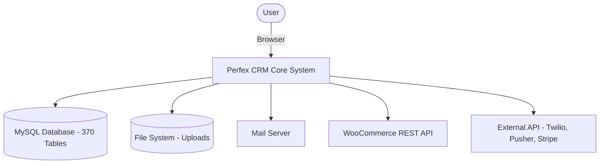

# Project Overview - Perfex CRM

## Purpose
This document provides a high-level summary and introduction to Perfex CRM, outlining its core objectives, market scope, and architectural pattern to serve as the foundation of the rebuilt application.

## Scope
Includes overview description, target audience, business goals, and architectural overview.

## Detailed Explanation
Perfex CRM is an open-source Customer Relationship Management (CRM) platform designed specifically for service providers, freelancers, and small-to-medium businesses. It consolidates lead management, invoicing, project tracking, tasks, support tickets, and client portals into a single, cohesive, self-hosted web application.

To extend the platform, this version integrates **10 specialized business modules**:
1. **Accounting & Bookkeeping**: General ledger, chart of accounts, banking, journal entries, balance sheet, profit/loss.
2. **HRM (Human Resources)**: Employee directory, attendance, leaves, payroll, onboarding.
3. **Recruitment**: Job openings, applicant tracking, interviews, hiring pipeline.
4. **Warehouse & Inventory**: Stock levels, imports, exports, loss & adjustments, shipments, deliveries.
5. **Purchase Management**: Purchase orders, suppliers, goods receipts, purchase invoices.
6. **Staff Outsourcing**: Resource bookings, timesheets, contractor management.
7. **OKRs**: Objectives, key results, parent/child OKR linkages, progress scoring.
8. **WooCommerce Integration**: Webhook syncing, orders mapping, products sync, client correlation.
9. **REST API**: REST API endpoints, API key authentication, request/response models.
10. **Multi Theme**: Custom skin overrides, admin/client theme assets.

### Key Objectives
1. **Consolidated Billing**: Manage proposals, estimates, invoices, and payments in one interface.
2. **Project & Task Management**: Keep projects organized, track timesheets, and assign tasks to staff members.
3. **Lead & Sales Pipeline**: Capture leads from web-to-lead forms and track their progression through customizable statuses.
4. **Customer Support Portal**: Ticket system allowing clients to raise issues and staff to respond with predefined replies.
5. **Extensibility**: Support customization through a modular architecture and an actions/filters hook system.

## Mermaid Diagrams

## References
- [Project Structure](03_Project_Structure.md)
- [Business Requirements](04_Business_Requirements.md)
- [Technology Stack](02_Technology_Stack.md)
