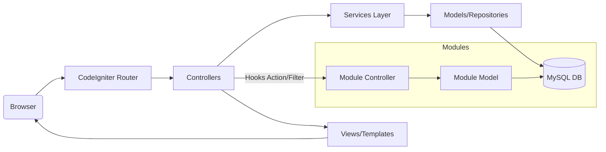

# System Architecture

## Purpose
Defines the architectural design of the Perfex CRM system, showing component interactions and design pattern enforcement.

## Scope
Covers framework structure, structural layers (MVC + Services), and component interaction.

## Detailed Explanation
The application is built on top of the PHP **CodeIgniter 3** MVC framework, augmented with a modern **Service Layer** to isolate business logic from controllers and models.

### Architecture Patterns
- **Model-View-Controller (MVC)**: Handles routing, requests (Controllers), data abstraction (Models), and presentation templates (Views).
- **Service-Oriented Design**: High-level business actions are orchestrated inside `application/services/` modules.
- **Hook/Event-Driven System**: Implemented using PHP actions and filters to enable third-party module integration.
- **Repository Pattern**: Integrated within CodeIgniter models to perform clean CRUD queries.

## Mermaid Diagrams

## Tables: Architectural Directory Structure
| Layer | Folder Path | Purpose |
| --- | --- | --- |
| Routing & HTTP | `application/controllers/` | Intercepts HTTP requests and invokes Services. |
| Business Logic | `application/services/` | Holds core application workflows, validations, and logic. |
| Data Layer | `application/models/` | Executes database transactions and SQL commands. |
| View Layer | `application/views/` | Output HTML, PHP templates, and admin layouts. |
| Modules Layer | `modules/` or Root directories | Extension modules containing their own MVC structures. |

## References
- [Project Structure](03_Project_Structure.md)
- [Technology Stack](02_Technology_Stack.md)
