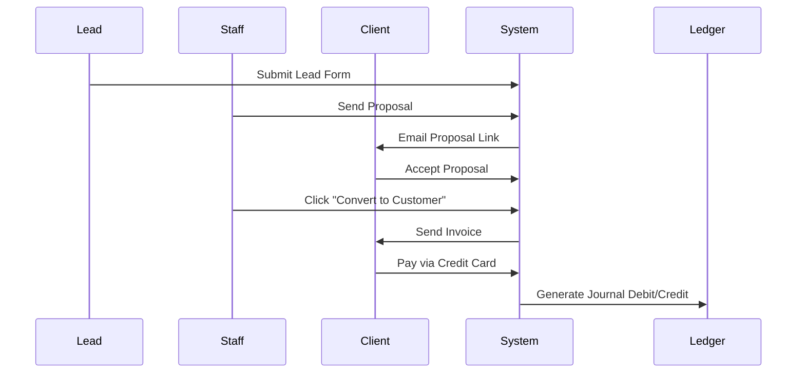

# Business Workflow

## Purpose
Traces the high-level logical business flows across CRM and module operations.

## Scope
Lead-to-Payment cycle, HR onboarding cycle, and Purchase-to-Stock cycle.

## Detailed Explanation

### 1. Lead-to-Payment Cycle
1. **Capture**: Lead captured from Web-to-lead form.
2. **Nurture**: Tasks assigned, logs recorded, proposal sent.
3. **Acceptance**: Client accepts proposal online.
4. **Convert**: Lead converted to Client and Project created.
5. **Invoice**: Invoice generated for project milestone.
6. **Payment**: Customer pays via credit card (Stripe).
7. **Bookkeeping**: Invoice payment triggers double-entry records (debit cash, credit accounts receivable).

### 2. Purchase-to-Stock Cycle
1. **Purchase Request**: Procurement officer submits request.
2. **Purchase Order**: Purchasing manager approves request and generates PO to Vendor.
3. **Goods Receipt**: Goods arrive at Warehouse; inventory manager registers a Goods Receipt voucher.
4. **Inventory Update**: System increments stock counts and recalculates average cost.
5. **Purchase Invoice**: Supplier sends invoice; billing matches PO and receipt to release payment.
6. **Journal Recording**: Ledger posts Debit Stock (Asset) and Credit Accounts Payable (Liability).

## Mermaid Diagrams

## References
- [System Workflow](10_System_Workflow.md)
- [Data Flow](18_Data_Flow.md)
