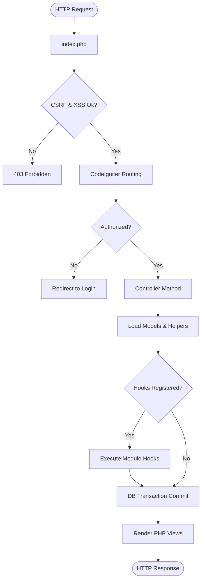

# System Workflow

## Purpose
Outlines technical request-response pipelines and module event chains.

## Scope
Routing, filters, controllers, hooks execution, and DB transactions.

## Detailed Explanation
When a request is submitted to the application, CodeIgniter intercepts it and routes it to the corresponding controller.

### HTTP Request Lifecycle
1. **Entry**: Request hits `index.php`.
2. **Routing**: System validates URL against routes config.
3. **Authentication Check**: Middleware checks session cookie or REST API key header.
4. **Input Security**: CodeIgniter filters global variables (XSS filtering, CSRF token validation).
5. **Controller Dispatch**: Controller loads relevant models and helper modules.
6. **Actions & Filters Hooks**: Core files execute `hooks()->apply_filters()` or `hooks()->do_action()` (allowing modules like accounting to intercept).
7. **Transaction Commit**: DB operations execute inside a transaction block. If an error occurs, it rollbacks.
8. **View Output**: System compiles PHP templates to HTML and outputs to browser.

## Mermaid Diagrams

## References
- [Business Workflow](09_Business_Workflow.md)
- [Event Flow](30_Event_Flow.md)
