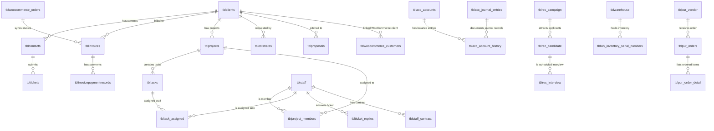

# Entity-Relationship (ER) Diagram

## Purpose
Exposes data entities and foreign key linkages visually using Mermaid.

## Scope
Outlines structural links between leads, clients, contacts, invoices, payments, projects, tasks, staff, and module extensions.

## Detailed Explanation
This diagram highlights how CRM clients, projects, support tickets, and invoicing modules are mapped to contacts, staff, and module-specific tables.

## Mermaid Diagrams

## References
- [Database Analysis](15_Database_Analysis.md)
- [Table Dictionary](16_Table_Dictionary.md)
