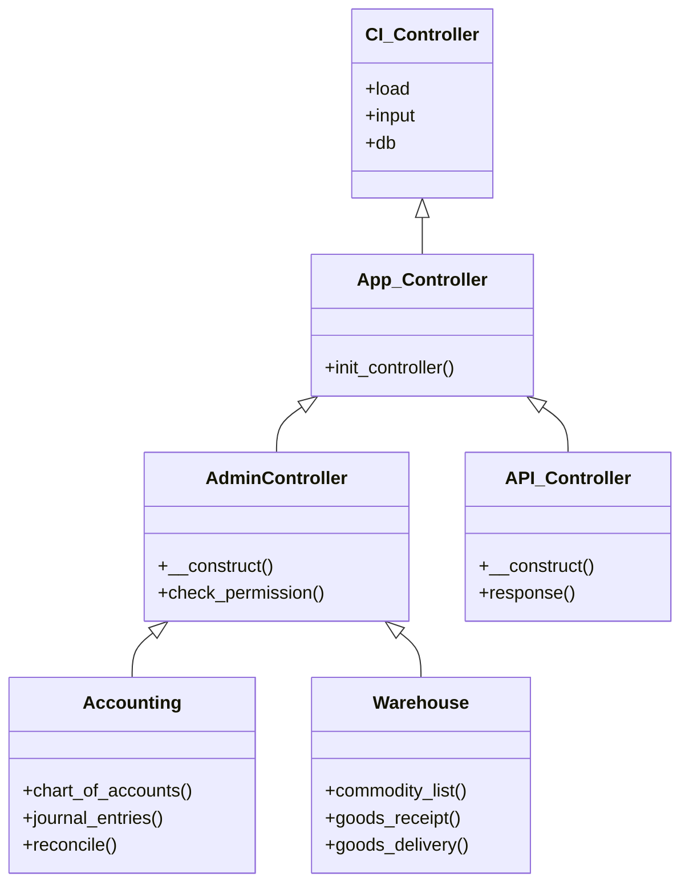

# Class Diagram

## Purpose
Exposes core classes, controllers, and models hierarchy inside the CodeIgniter 3 runtime.

## Scope
Core class structures, module extensions, and model interfaces.

## Detailed Explanation
In CodeIgniter, Controllers inherit from `MX_Controller` (for modular architecture) or `AdminController`/`ClientsController` (for authentication mappings). Models inherit from `App_Model`.

### Inheritance Class Structures
- **Core Controller**: `AdminController` extends `App_Controller` extends `CI_Controller`.
- **Core Model**: `App_Model` extends `CI_Model`.
- **Accounting Controller**: `Accounting` extends `AdminController`.
- **Recruitment Controller**: `Recruitment` extends `AdminController`.
- **Warehouse Controller**: `Warehouse` extends `AdminController`.

## Mermaid Diagrams

## References
- [Project Structure](03_Project_Structure.md)
- [System Architecture](01_System_Architecture.md)
