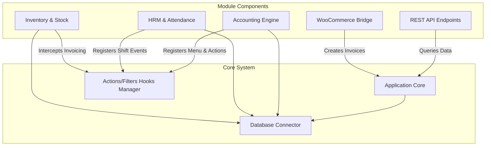

# Component Diagram

## Purpose
Visualizes modular dependencies and structural component layout.

## Scope
Core application, plugins, extensions, and external connectors.

## Detailed Explanation
The Perfex CRM system contains a central application core that exposes an Actions/Filters Hooks service. All 10 modules function as separate components that hook into the core dynamically to inject menus, extend dashboards, listen to payment webhooks, or query REST APIs.

## Mermaid Diagrams

## References
- [System Architecture](01_System_Architecture.md)
- [Event Flow](30_Event_Flow.md)
