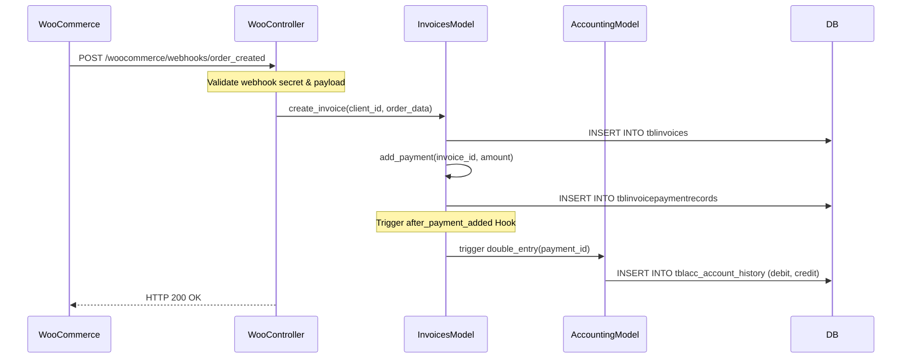

# Sequence Diagram

## Purpose
Documents transactional sequence flows inside the system.

## Scope
WooCommerce sync workflows, Stripe payment hooks, and accounting entries.

## Detailed Explanation
Traces execution timelines across Controller, Service, Database, and Event Hooks.

### Sequence: WooCommerce Order Invoiced in CRM
1. **WooCommerce Store** triggers a "payment_completed" webhook to CRM.
2. **WooCommerce Controller** intercepts request, validates payload.
3. **WooCommerce Repository** logs order cache to `tblwoocommerce_orders`.
4. **WooCommerce Service** checks customer mapping (matches email or creates customer contact).
5. **Invoices Model** creates a new invoice draft in `tblinvoices`.
6. **Payments Model** records invoice payment record in `tblinvoicepaymentrecords`.
7. **Accounting Helper** captures payment creation, builds journal debits and credits, committing transaction.

## Mermaid Diagrams

## References
- [Business Workflow](09_Business_Workflow.md)
- [System Workflow](10_System_Workflow.md)
