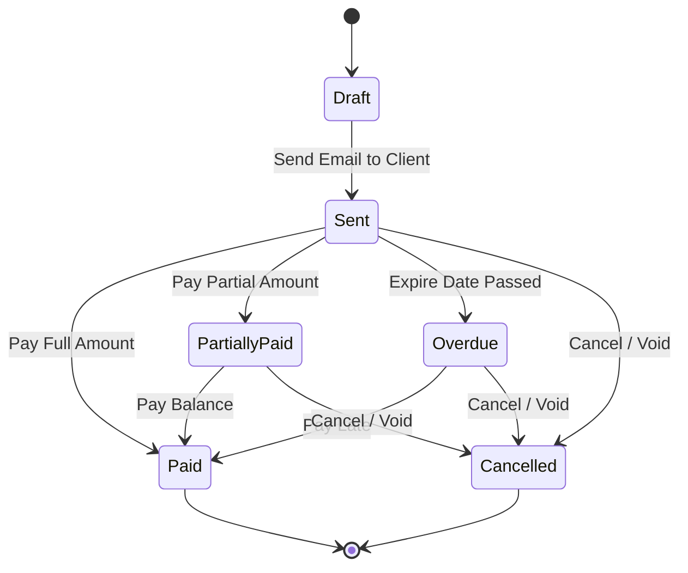

# State Diagram

## Purpose
Exposes state transition cycles of core business entities.

## Scope
Leads, Invoices, Project Tasks, Support Tickets, OKRs, and Candidates.

## Detailed Explanation
Lifecycle states of primary entities are tracked via integer or string status columns in the database.

### Invoice Lifecycle States
- **Draft (1)**: Invoice created but not sent.
- **Sent (2)**: Invoice sent to client.
- **Paid (3)**: Client paid in full.
- **Partially Paid (4)**: Partial payment registered.
- **Overdue (5)**: Past expiry date without full payment.
- **Cancelled (6)**: Invoice voided.

### Lead Lifecycle States
- **New / Contacted**: Initial captures.
- **Nurturing**: active communication, proposal sent.
- **Converted**: Converted to client contact.
- **Lost**: Lead disqualified.

## Mermaid Diagrams

## References
- [Use Cases](08_Use_Cases.md)
- [Validation Rules](26_Validation_Rules.md)
