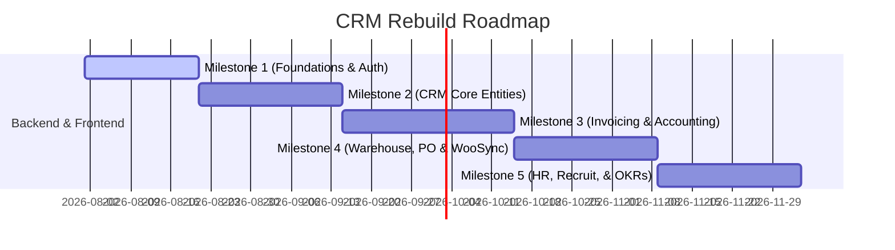

# Implementation Plan: Phased Rebuild Milestones

This document establishes the phased implementation roadmap for rebuilding the legacy PHP CRM into the modern **FastAPI & Next.js** clean architecture. Each milestone is designed to be independently developed, deployed, and run.

---

## Rebuild Roadmap Overview

To minimize risk and ensure continuous delivery, we divide the rebuild into **5 distinct milestones**:

---

## Detailed Milestones Specification

### Milestone 1: Foundations & Authentication (Base System)
*   **Goal**: Establish the base directory structure, database migration framework, API routing base, and user authentication portal.
*   **Backend Components**:
    *   FastAPI boilerplate config (CORS, logs, standard HTTP error interceptors).
    *   PostgreSQL connections via async SQLAlchemy engine and session pool.
    *   Alembic initialization and base tables migration mapping (`tblstaff`, `tblroles`, `tblsessions`).
    *   JWT credentials login, access tokens, refresh tokens via secure HTTP-Only cookies, and sign-out endpoints.
*   **Frontend Components**:
    *   Next.js project setup using App Router, TypeScript, and Tailwind CSS.
    *   Configure shadcn/ui theme provider (supporting Dark/Light mode).
    *   Login panel with client-side form validation (React Hook Form, Zod).
*   **Verification**:
    *   `pytest` validating access/refresh token generation, validation, and expiry.
    *   Manual web verification of user redirect to login interface.

---

### Milestone 2: CRM Core CRUD Entities
*   **Goal**: Implement leads tracking, client portals, project deliverables, and customer support.
*   **Backend Components**:
    *   CRUD schemas and routers for Leads, Clients, Contacts, Projects, Tasks, and Support Tickets.
    *   Pydantic validation schemas.
    *   File upload middleware for task and ticket attachments.
*   **Frontend Components**:
    *   Nested sidebar dashboard layout.
    *   **Leads board**: Drag-and-drop Kanban interface for leads tracking.
    *   **Client Directory**: Grid layout listing client companies, including details and contact profiles.
    *   **Support Portal**: Ticket generation form for customers and ticket list/response panel for staff.
*   **Verification**:
    *   Integration API tests verifying creation, status transition, and security boundaries.

---

### Milestone 3: Invoicing, Billing & Double-Entry Accounting
*   **Goal**: Migrate billing transactions and integrate the double-entry posting engine.
*   **Backend Components**:
    *   Invoices, Items, Payments, Estimates, and Expenses databases.
    *   Double-entry posting services triggered via transactional decorators.
    *   Manual Journal Entry validators ensuring Debits equal Credits.
    *   Financial reporting ledger processors (Trial Balance, P&L, Balance Sheet).
*   **Frontend Components**:
    *   **Invoice builder**: Dynamic invoice builder form.
    *   **Chart of Accounts**: Interactive tree layout representing assets, liabilities, equities, revenues, and expenses.
    *   **Ledger Reports**: P&L statements, Balance Sheets with date filters.
*   **Verification**:
    *   Test double-entry operations under concurrent invoice payment simulations to ensure ledger balance.

---

### Milestone 4: Warehouse, Purchase & WooCommerce Sync
*   **Goal**: Implement warehouse management, vendor procurement cycles, and automated WooCommerce sync tasks.
*   **Backend Components**:
    *   Warehouse list, Commodities, Goods Receipts, Goods Deliveries databases.
    *   Vendor records, RFQs, Purchase Orders, and Purchase Invoices databases.
    *   Celery scheduler triggering async synchronization of products, customers, and orders from WooCommerce.
*   **Frontend Components**:
    *   **Stock Ledger View**: Warehouse stock grid with inward/outward movement metrics.
    *   **Procurement Hub**: Vendor profiles, RFQ status dashboards.
    *   **Woo Sync Control Panel**: Integration sync scheduler configurations, stores credential manager, and real-time synchronization logs panel.
*   **Verification**:
    *   Test Celery sync tasks with mock WooCommerce server APIs.

---

### Milestone 5: HR, Recruitment & OKRs
*   **Goal**: Rebuild staff rosters, leaves, attendance systems, recruitment applicant trackers, and OKRs.
*   **Backend Components**:
    *   Work Shifts, Daily Attendance, Leave Applications, Employee Contracts databases.
    *   Job Position Campaigns, Candidates profile records, Interview feedback grids.
    *   OKRs (Objectives, Key Results, Parent linkages) databases.
*   **Frontend Components**:
    *   **Attendance Board**: Check-in/out console widget.
    *   **Recruitment Funnel**: Candidate pipelines status cards dashboard.
    *   **OKR Board**: Hierarchy tree layout visualizing key results links and weights.
*   **Verification**:
    *   Unit test payroll structures, leave calculation routines, and OKR weight calculations.
