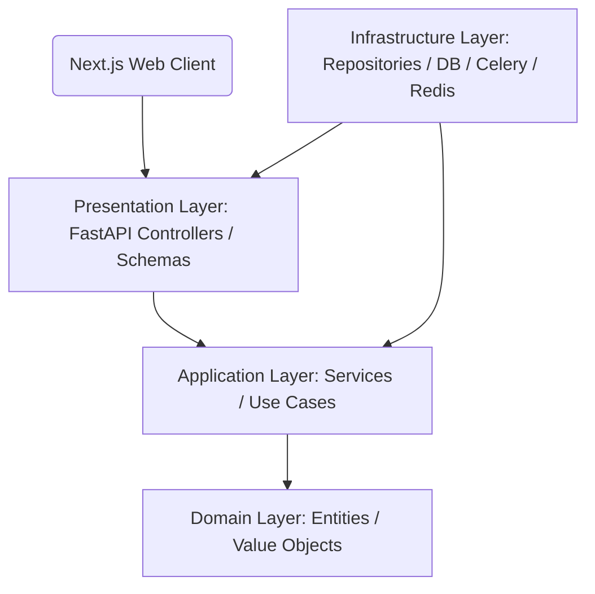
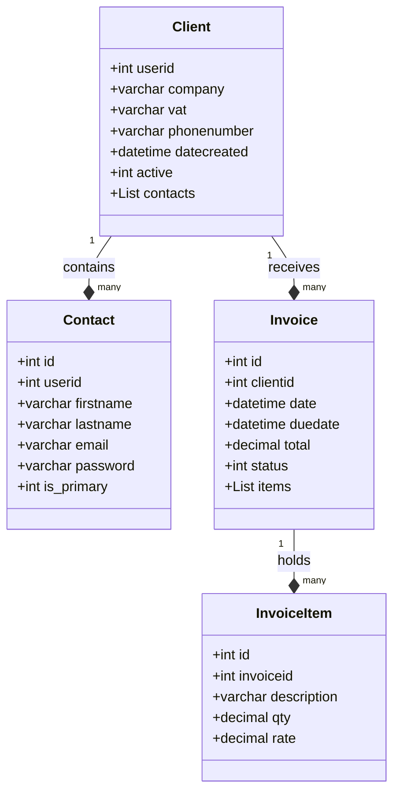

# Software Design: Clean Architecture with DDD (FastAPI & Next.js)

This document describes the software design and target blueprints for migrating the legacy monolithic CRM to a decoupled, high-performance web application utilizing **Python FastAPI** (Clean Architecture/DDD) and **Next.js App Router**.

---

## 1. System Architecture Blueprint

The application employs **Domain-Driven Design (DDD)** principles and is divided into distinct structural layers:



### Architectural Layers
1.  **Domain Layer (`domain/`)**: The core business heart of the system. Contains SQLAlchemy declarative tables, enterprise validation rules, and abstract repository boundaries. Free of external library imports (e.g. database-session logic).
2.  **Application Layer (`application/`)**: Orchestrates use case flows, registers business transactions, maps schemas, and handles email/messaging triggers.
3.  **Infrastructure Layer (`infrastructure/`)**: Implements abstract repositories, manages connections to PostgreSQL and Redis, and hosts Celery task workers.
4.  **Presentation Layer (`api/`)**: Defines HTTP routers, Pydantic request/response models (schemas), dependency injectors, and error handlers.

---

## 2. Directory Layouts

### A. Backend (FastAPI + DDD)
```text
backend/
├── app/
│   ├── api/                 # Presentation Layer
│   │   ├── v1/              # Version 1 endpoints
│   │   │   ├── auth.py      # Login, Refresh, Password reset
│   │   │   ├── clients.py   # Client endpoints
│   │   │   ├── accounting.py# Accounting modules
│   │   │   └── leads.py     # Leads endpoints
│   │   └── dependencies.py  # Auth, DB Session injections
│   ├── core/                # System core configs
│   │   ├── config.py        # Environment loader
│   │   ├── security.py      # JWT hashing helpers
│   │   └── logging.py       # Central log system
│   ├── domain/              # Domain Layer (Enterprise Core)
│   │   ├── models/          # Declarative SQLAlchemy models
│   │   │   ├── base.py
│   │   │   ├── client.py
│   │   │   ├── invoice.py
│   │   │   └── accounting.py
│   │   └── repositories/    # Abstract interfaces
│   ├── application/         # Application Layer (Use Cases)
│   │   ├── services/        # Service modules orchestrating logic
│   │   │   ├── invoice.py
│   │   │   └── accounting_sync.py
│   │   └── schemas/         # Pydantic v2 validation classes
│   │       ├── client.py
│   │       └── invoice.py
│   └── infrastructure/      # Infrastructure Layer (Adapter Core)
│       ├── database.py      # PostgreSQL Sessionmaker
│       ├── repositories/    # Concrete SQLAlchemy repositories
│       │   ├── client_repo.py
│       │   └── invoice_repo.py
│       ├── redis.py         # Caching and token storage
│       └── celery_app.py    # Background task broker
├── alembic/                 # Database migrations
├── tests/                   # Pytest automation suite
├── Dockerfile.dev           # Development Container
└── requirements.txt         # Package dependencies
```

### B. Frontend (Next.js App Router)
```text
frontend/
├── src/
│   ├── app/                 # Next.js App Routing Layout
│   │   ├── (auth)/          # Authentication page route grouping
│   │   │   ├── login/
│   │   │   └── page.tsx
│   │   ├── (dashboard)/     # Main Admin/Staff dashboard area
│   │   │   ├── layout.tsx
│   │   │   ├── clients/     # Customer management screen
│   │   │   ├── accounting/  # Chart of Accounts, Ledgers
│   │   │   └── page.tsx     # Dashboard home
│   │   └── layout.tsx
│   ├── components/          # Reusable shared UI components
│   │   ├── ui/              # shadcn/ui components (Button, Input, Table)
│   │   ├── charts/          # Dashboard analytics components
│   │   └── layout/          # Sidebar, Navbar templates
│   ├── hooks/               # Custom react-query hooks
│   │   ├── use-auth.ts
│   │   └── use-clients.ts
│   ├── lib/                 # Utility libraries
│   │   ├── api-client.ts    # Axios configuration
│   │   └── utils.ts         # Formatting and styling helpers
│   └── types/               # TypeScript interfaces
```

---

## 3. Database Modeling & Entity Maps



### Key Declarative Implementation (SQLAlchemy 2.0)
```python
from sqlalchemy.orm import DeclarativeBase, Mapped, mapped_column, relationship
from sqlalchemy import String, ForeignKey, DateTime, DECIMAL
from datetime import datetime

class Base(DeclarativeBase):
    pass

class Client(Base):
    __tablename__ = "clients"
    
    userid: Mapped[int] = mapped_column(primary_key=True, autoincrement=True)
    company: Mapped[str] = mapped_column(String(191), nullable=True)
    vat: Mapped[str] = mapped_column(String(50), nullable=True)
    phonenumber: Mapped[str] = mapped_column(String(30), nullable=True)
    datecreated: Mapped[datetime] = mapped_column(DateTime, default=datetime.utcnow)
    active: Mapped[int] = mapped_column(default=1)
    
    contacts: Mapped[list["Contact"]] = relationship(back_populates="client", cascade="all, delete-orphan")

class Contact(Base):
    __tablename__ = "contacts"
    
    id: Mapped[int] = mapped_column(primary_key=True, autoincrement=True)
    userid: Mapped[int] = mapped_column(ForeignKey("clients.userid", ondelete="CASCADE"))
    firstname: Mapped[str] = mapped_column(String(191))
    lastname: Mapped[str] = mapped_column(String(191))
    email: Mapped[str] = mapped_column(String(100), unique=True, index=True)
    password: Mapped[str] = mapped_column(String(255), nullable=True)
    is_primary: Mapped[int] = mapped_column(default=1)
    
    client: Mapped["Client"] = relationship(back_populates="contacts")
```

---

## 4. Authentication & Authorization Design

### A. JWT Token Flow
*   **Access Token**: Short lifespan (15 minutes), containing the user ID, email, role, and API scopes. Passed via HTTP headers (`Authorization: Bearer <token>`).
*   **Refresh Token**: Long lifespan (7 days), stored securely in an `httpOnly`, `secure`, `SameSite=Strict` cookie, used exclusively to request a new access token from `/api/v1/auth/refresh`.
*   **Session Revocation**: Stored in a Redis denylist of active JWT hashes. Logout invalidates tokens instantly.

### B. RBAC & Security Scopes
FastAPI permissions are validated using security scopes:
```python
from fastapi import Security, Depends, HTTPException
from fastapi.security import SecurityScopes

async def get_current_user(
    security_scopes: SecurityScopes,
    token: str = Depends(oauth2_scheme)
) -> User:
    # Token decode and scope validation logic
    for scope in security_scopes.scopes:
        if scope not in token_data.scopes:
            raise HTTPException(status_code=403, detail="Not enough permissions")
    return user
```

Roles are mapped directly to scopes:
*   `Admin`: `["core:read", "core:write", "accounting:all", "hrm:all", "recruitment:all"]`
*   `Accountant`: `["accounting:read", "accounting:write", "core:read"]`
*   `Staff`: `["core:read", "core:write"]`
*   `Client`: `["portal:read", "portal:write"]`
