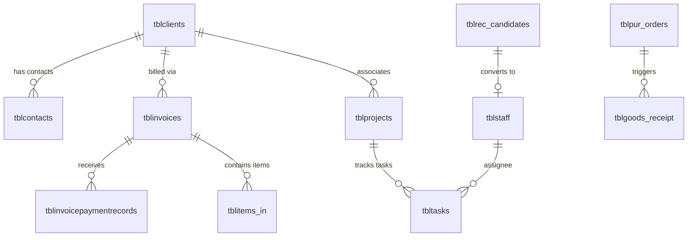
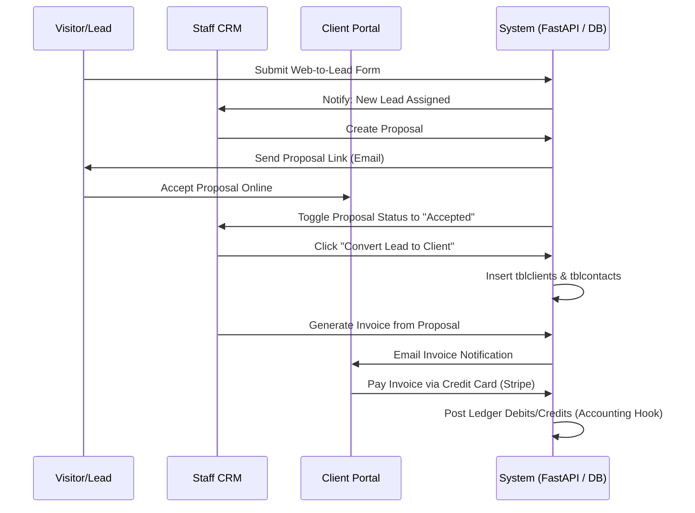
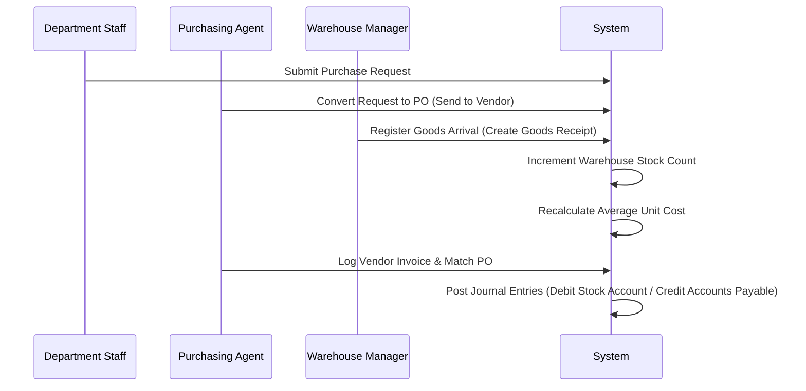

# System Analysis: Legacy Perfex CRM with 10 Custom Modules

This document provides a comprehensive functional and architectural analysis of the legacy **Perfex CRM** monolithic system and its **10 custom modules**. This analysis serves as the primary business logic blueprint for migration to the modern Python FastAPI / Next.js Clean Architecture.

---

## 1. Business Rules & Logic

The legacy system acts as an ERP/CRM hybrid, orchestrating workflows across multiple business domains:

### A. Sales & Billing Rules
*   **Leads to Customers**: A Lead can have customizable statuses (e.g., Prospect, Contacted, Proposal Sent). When converted to a Customer, a new Client record is created, and the lead is marked as converted (`tblleads.converted = 1`). A Project is optionally spawned immediately.
*   **Estimates & Proposals**:
    *   Proposals can be sent to both Leads and Customers.
    *   Estimates are sent to existing Customers.
    *   Accepting a Proposal/Estimate via the Client Portal automatically toggles its status to "Accepted" and prompts staff to generate an Invoice.
*   **Invoicing**:
    *   Invoices can be manual or generated from Projects, Proposals, or Subscriptions.
    *   A payment increments the invoice's total paid field. If total paid equals the invoice total, status changes to "Paid" (status 2). Partial payments set status to "Partially Paid" (status 3).
    *   Overdue invoices are calculated daily by cron (`cron.php`) comparing `duedate` to the current date, marking status as "Overdue" (status 5) and triggering late payment notifications.

### B. Accounting Rules
*   **Double-Entry Posting Engine**: The Accounting module intercepts core CRM actions using hooks:
    *   **Invoice Payment Received**: Triggers a journal entry debiting Cash/Bank (Asset) and crediting Accounts Receivable (Asset/Debtor).
    *   **Expense Created**: Triggers a journal entry debiting the specific Expense account and crediting Cash/Bank or Accounts Payable.
*   **Ledger Equilibrium**: A manual Journal Entry must balance perfectly. The sum of Debits must equal the sum of Credits (\(\sum \text{Debits} = \sum \text{Credits}\)) prior to save validation.

### C. Warehouse & Inventory Rules
*   **Inventory Valuations**: Average item cost is calculated dynamically upon new stock receipt.
*   **Stock Inward/Outward**:
    *   **Goods Receipt**: Increases physical inventory stock count (`tblgoods_receipt`).
    *   **Goods Delivery**: Decreases physical inventory stock count (`tblgoods_delivery`).
*   **Loss Adjustments**: Stock adjustments record positive/negative variations (damage, loss, count corrections) and must map to corresponding ledger adjustments.

### D. HR & Recruitment Rules
*   **Shift & Attendance**: Staff must check in/out within defined shift window ranges. Attendance calculations track late logins and early logouts.
*   **Applicant Conversion**: Candidates passing all interview rounds are converted to Staff members, migrating their personal records from `tblrec_candidates` to `tblstaff` and initiating an employee contract.

---

## 2. Entities & Relational Schema Summary

The database consists of **370 tables** (MySQL InnoDB). The schema is split between Core CRM tables and Module-specific prefixes:

### Core Schema Prefixes
*   **tblclients**: Core customer company information (primary key: `userid`).
*   **tblcontacts**: Contact persons associated with clients (foreign key: `userid` references `tblclients.userid`). Handles client portal login credentials.
*   **tblleads**: Business leads tracker.
*   **tblinvoices / tblinvoicepaymentrecords**: Billing transactions.
*   **tblprojects / tbltasks**: Project operational delivery and timesheet logging.

### Custom Module Schema Prefixes
*   `tblacc_` (Accounting): Accounts tree, journal entries, historical ledger entries.
*   `tblhrm_` / `tblwork_` (HRM): Shift rosters, leave requests, payroll calculations, contracts.
*   `tblrec_` (Recruitment): Job postings, campaigns, candidate applications, interview logs.
*   `tblgoods_` / `tblwh_` / `tblware_` (Warehouse): Stock allocations, delivery vouchers, internal movements.
*   `tblpur_` (Purchase): Vendors, purchase orders, RFQs, vendor invoices.
*   `tblokr_` (OKRs): Objectives, key results, evaluations, weights.
*   `tblwoocommerce_` (WooCommerce Sync): Stores settings, order maps, product sync caches.

---

## 3. UI Navigation & Menus

The backend uses a nested sidebar navigation. Modules inject routes dynamically into this tree:

*   **Dashboard**: Main KPI stats (Core CRM).
*   **Customers**: Management interface for companies and individual contacts.
*   **Sales**: Sub-sections for Proposals, Estimates, Invoices, Payments, Credit Notes, Items.
*   **Recruitment**: Job Campaign setup, Applicant queues, Interview schedules.
*   **HRM**: Staff roster, Attendance logs, Leave requests approval board.
*   **Warehouse**: Commodities inventory, Goods Receipt/Delivery trackers, Delivery shipments.
*   **Purchase**: Vendor list, RFQs, PO status tracker, Vendor bills.
*   **Accounting**: Accounts hierarchy tree, Journal Entries builder, Reconcile module, Reports (P&L, Balance Sheet).
*   **OKRs**: Personal/Company OKR mapping dashboard.
*   **WooCommerce**: Sync status logs, store credential mappings.

---

## 4. Workflows

### A. Lead-to-Payment Workflow

### B. Purchase-to-Stock Workflow

---

## 5. Security & Permission Rules

The system follows a strict Role-Based Access Control (RBAC) authorization matrix.

*   **Access Control**: Handled using the helper `has_permission($permission, $staff_id, $action)`. Permissions are mapped against `tblstaff_permissions`.
*   **Scopes**:
    *   `view`: Staff can only see entries (or only entries they created, if `view_own` restriction is active).
    *   `create`: Add new entries.
    *   `edit`: Modify existing entries.
    *   `delete`: Remove entries.
*   **Client Portal**: Authenticated contacts are verified against `tblcontact_permissions` to ensure they only access allowed resources (Invoices, Projects, Proposals).
*   **API Security**: External requests passing through the REST API module are authenticated using API key tokens passed in headers.
*   **OWASP Security**: Legacy MVC utilizes manual inputs sanitization (XSS filtering) and SQL escaping via Active Record queries.

---

## 6. External API & Background Pipelines

### A. REST API Schema
*   **Authentication**: `Authorization: [API_KEY]` validated against `tbluser_api`.
*   **Key Endpoints**:
    *   `GET /api/clients`: Fetch customer profiles.
    *   `POST /api/clients`: Create a customer page.
    *   `GET /api/invoices`: List bills.
    *   `POST /api/invoices`: Create client invoice.
    *   `POST /api/leads`: Create new lead.

### B. Background Jobs (Central Cron)
The scheduler triggers `cron.php` every minute:
*   **Email Transmitter**: Fetches pending items from `tblmail_queue` and sends them via SMTP.
*   **Subscription Recurrences**: Runs daily at midnight. Evaluates `tblsubscriptions` and issues new invoices for active cycles.
*   **WooSync Engine**: Syncs WooCommerce stock, order records, and mapping updates.

---

## 7. Reports & Print Layouts

*   **Financial Reports**: Computes Ledger balances dynamically from journal history tables. Calculates P&L and Trial Balance.
*   **Print Engine**: HTML views compiled into PDFs using TCPDF. Supports template modifications for Invoices, Estimates, and Contracts.
*   **Dashboard Metrics**: Chart.js graphs displaying Sales (Monthly revenues vs. Expenses), Task completions, and active support tickets.
